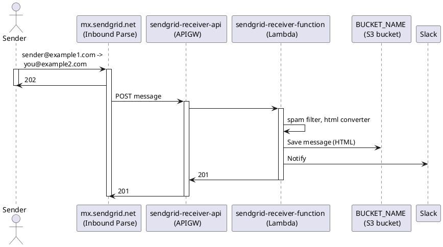
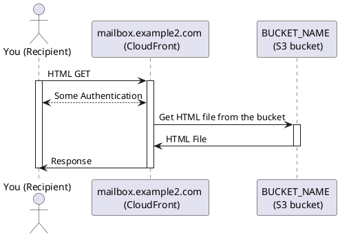

# sendgrid-receiver-aws

A serverless email receiver with below components:

- SendGrid Incoming Webhook
- Amazon API Gatewawy
- AWS Lambda
- Amazon S3 bucket (email objects converted to html)
- Amazon CloudFront

## Design Overview

Receiving an email:



Reading an email (NOTE: this is just an example because CloudFront and its authentication mechanism is out of scope in this project):




## how to use

1. set up SendGrid Incoming Webhook with
    - your email domain
    - generated API-Gateway endpoint

2. set up email viewer side
    - create S3 bucket
    - create CloudFront distribution with S3 bucket static web hosting

3. *Docker* is required on your local machine before executing `sls deploy`.  This is because you need to bundle required pip module by using docker environment.

4. set up serverless components
    ```sh
    npm install -g serverless
    npm install
    pip install -r requirements.txt
    cp .env_sample .env
    vim .env
    npx sls deploy --stage <stagename>
    ```

\# 2021/08/14 NOTE for SLS CLI command: stage variable や env var の sls v3 での扱い方 (variable resolver の挙動) については議論が様々進行中のようで、この方法が安定して将来も使える方法とは限らない。 issue [Environment variable in serverless\.yml throws "Cannot resolve \.\.\." error · Issue \#9813 · serverless/serverless](https://github.com/serverless/serverless/issues/9813) の行方を watch する必要あり。

## some more reference

See my blog: [SendGrid Receiver on AWS
](https://wiki.georgeorge.com/docs/tech/sendgrid-receiver-aws/)